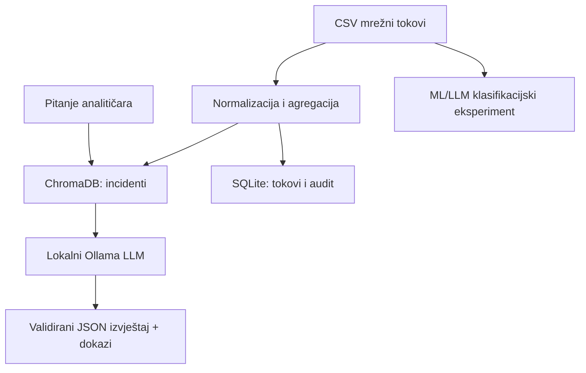

# Analysis of Security Threats in Network Logs Using Large Language Models

NetlogRAG je istraživački prototip za lokalnu analizu mrežnih tokova. Projekt ima dva jasno odvojena cilja:

1. **RAG potpora analitičaru** – dohvat agregiranih vremenskih prozora prometa i generiranje strukturiranog izvještaja uz trag korištenih dokaza.
2. **Nadzirana klasifikacija tokova** – usporedba klasičnih ML modela s tri lokalna LLM-a prije i nakon QLoRA fine-tuninga i GGUF kvantizacije.

Projekt ne tvrdi da je produkcijski IDS. Semantička sličnost nije vjerojatnost napada, a LLM izvještaj mora potvrditi stručnjak. Mjerenja fine-tuniranih modela nisu unaprijed navedena: generiraju se eksperimentalnim skriptama na konkretnom hardveru i spremaju s konfiguracijom pokusa.

## Što je promijenjeno u reviziji

- RAG indeksira **agregirane incidente** (izvorna IP adresa + petominutni prozor), umjesto izoliranih redaka.
- Upit se može ograničiti na jednu ulaznu datoteku; odgovor sadrži model, način detekcije, verziju prompta i ID-eve dokaza.
- Oznaka klase (`Label`) nije dio dokumenta, embeddinga ni inference prompta.
- Fine-tuning i inference koriste jednu verzioniranu shemu od 17 numeričkih značajki.
- Duplikati istih značajki ostaju u istom splitu kako bi se smanjilo curenje podataka.
- Dodani su validacija JSON izlaza, sigurniji upload, ograničenja ulaza, migracije baze, testovi i CI.
- Klasični baseline koristi isti redoslijed značajki u treningu, evaluaciji i predikciji.
- Eksperimentalni pipeline pokriva tri modela, base/fine-tuned evaluaciju, GGUF Q4_K_M izvoz i mjerenje Ollama inferencea.

## Arhitektura



| Sloj | Tehnologija | Uloga |
|---|---|---|
| API | FastAPI | Upload, indeksiranje, pretraga, RAG, baseline i LLM klasifikacija |
| RAG | ChromaDB + sentence-transformers | Semantičko rangiranje agregiranih incidenata |
| Lokalni LLM | Ollama | Strukturirani sigurnosni izvještaj i kvantizirani klasifikator |
| Podaci | SQLite | Tokovi, metapodaci i audit povijest upita |
| Baseline | Random Forest + XGBoost | Referentna klasifikacija numeričkih tokova |
| Sučelje | Vue 3 + Vite | Interaktivni rad s lokalnim backendom |

## Brzo pokretanje aplikacije

Preduvjeti su Python 3.11 ili 3.12, Node.js 20.19+ ili 22.12+ i [Ollama](https://ollama.com/).

```bash
git clone https://github.com/lovro52/RazvojIT-rijesenja.git
cd RazvojIT-rijesenja
git switch codex/thesis-revision

python -m venv .venv
source .venv/bin/activate             # Windows: .venv\Scripts\activate
pip install -r requirements.txt
cp .env.example .env
ollama pull llama3.1:8b
uvicorn main:app --reload
```

U drugom terminalu:

```bash
cd frontend
npm ci
npm run dev
```

- API dokumentacija: <http://localhost:8000/docs>
- Web sučelje: <http://localhost:5173>

Konfiguracijske putanje računaju se od korijena projekta, pa pokretanje ne ovisi o trenutnom direktoriju procesa. Upload je ograničen varijablom `MAX_UPLOAD_BYTES`; zadana vrijednost je 250 MB.

## Radni tok

1. Učitaj CSV na stranici **Upload**.
2. Indeksiraj datoteku. Backend normalizira tokove, sprema ih u SQLite i u ChromaDB zapisuje agregirane incidente.
3. Na stranici **Query** odaberi indeksiranu datoteku i postavi pitanje.
4. Provjeri `evidence_highlights` i pripadajuće incidente. `similarity` je rangirajući kosinusni rezultat, ne kalibrirano povjerenje.
5. Baseline trening iz sučelja služi demonstraciji. Rezultat slučajnog splita nije glavni rezultat diplomskog rada.

Način analize HTTP payloada namjerno je onemogućen: CICIDS tokovi ne sadrže izvorni sadržaj HTTP zahtjeva, pa se iz njih ne može pošteno evaluirati payload detekcija SQL injectiona ili XSS-a.

## Fine-tuning i evaluacija

Detaljne naredbe, metodologija i očekivani artefakti opisani su u [experiments/README.md](experiments/README.md). Kandidati su:

| Ključ | Model | Licenca | Uloga |
|---|---|---|---|
| `qwen3-1.7b` | `Qwen/Qwen3-1.7B` | Apache-2.0 | mali opći instruct model |
| `smollm3-3b` | `HuggingFaceTB/SmolLM3-3B` | Apache-2.0 | kompaktan 3B model |
| `phi4-mini` | `microsoft/Phi-4-mini-instruct` | MIT | snažniji mali instruct model |

Za svaki model mjeri se najmanje: accuracy, macro-F1, per-class precision/recall/F1, matrica zabune, stopa nevaljanog JSON-a, medijan i p95 latencije te propusnost. Base i fine-tuned varijanta koriste isti zaključani testni skup. CSE-CIC-IDS2018 preporučen je kao **vanjski test distribucijskog pomaka**, a ne kao nekontrolirani dodatak trening skupu.

Notebook [NetlogRAG_FineTuning_v3.ipynb](notebooks/NetlogRAG_FineTuning_v3.ipynb) je tanki Colab orkestrator nad verzioniranim skriptama. Raniji `NetlogRAG_FineTuning_v2.ipynb` ostaje povijesni pilot i nije prepisan.

## Testovi i provjere

```bash
pip install -r requirements-dev.txt
ruff check .
pytest -q --cov=app

cd frontend
npm ci
npm run lint
npm run build
npm audit --omit=dev
```

GitHub Actions izvršava backend testove te frontend lint i build za push i pull request.

## Ograničenja i prijetnje valjanosti

- CICIDS2017 je laboratorijski i stariji skup; rezultati se ne mogu automatski prenijeti na suvremenu produkcijsku mrežu.
- Duplikatno grupirani slučajni split smanjuje izravno curenje, ali ne uklanja korelaciju istog dana/scenarija. Za strožu tvrdnju treba dodatno prijaviti rezultat podjele po datoteci ili danu.
- Klase su izrazito neuravnotežene; zato je macro-F1 primarna metrika, a accuracy pomoćna.
- LLM klasifikator pretvara numeričke značajke u tekst. To povećava trošak i možda neće nadmašiti tablični ML; usporedba mora uključiti kvalitetu i brzinu.
- Lokalno izvođenje smanjuje slanje podataka trećim stranama, ali samo po sebi ne osigurava GDPR usklađenost ni sigurnu implementaciju.
- “Real-time” sposobnost prihvaća se samo ako izmjerena propusnost na navedenom hardveru zadovoljava unaprijed definiran prometni cilj.

## Reproduktivnost i podaci

Veliki CSV-ovi, modeli, SQLite/Chroma datoteke, adapteri i GGUF artefakti namjerno nisu u repozitoriju. `prepare_dataset.py` u izvještaj zapisuje SHA-256 izvora, seed, broj primjera po klasi, odbačene konflikte i split protokol. Time se rezultat može povezati s točnim ulazima bez objavljivanja osjetljivih podataka.

Primarni skup: [CICIDS2017](https://www.unb.ca/cic/datasets/ids-2017.html). Predloženi vanjski skup: [CSE-CIC-IDS2018](https://www.unb.ca/cic/datasets/ids-2018.html).

## Literatura i tehnički izvori

- Lewis et al. (2020), *Retrieval-Augmented Generation for Knowledge-Intensive NLP Tasks*, NeurIPS.
- Hu et al. (2022), *LoRA: Low-Rank Adaptation of Large Language Models*, ICLR.
- Dettmers et al. (2023), *QLoRA: Efficient Finetuning of Quantized LLMs*, NeurIPS.
- [Qwen3-1.7B model card](https://huggingface.co/Qwen/Qwen3-1.7B)
- [SmolLM3-3B model card](https://huggingface.co/HuggingFaceTB/SmolLM3-3B)
- [Phi-4-mini-instruct model card](https://huggingface.co/microsoft/Phi-4-mini-instruct)
- [TRL SFTTrainer documentation](https://huggingface.co/docs/trl/sft_trainer)
- [Transformers bitsandbytes documentation](https://huggingface.co/docs/transformers/quantization/bitsandbytes)

## Licenca

Repozitorij trenutačno nema deklariranu licencu. Prije javne distribucije potrebno je dodati licencu projekta i provjeriti uvjete distribucije svih modela i skupova podataka.
